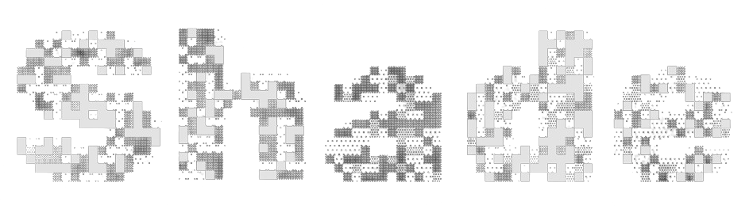

<h1 align="center">
  <a href="https://github.com/mhss1/Shade">
    
  </a>
  <br>
  
</h1>

<p align="center">
  <a href="https://github.com/mhss1/Shade/releases">
    
  </a>
  <a href="https://www.gnu.org/licenses/agpl-3.0">
    
  </a>
  
</p>

---

**Shade** is an on-device NSFW content blocker for Android. It works across any app on your phone in
real-time — no web views or wrappers required. Just native, private content filtering powered by a custom-trained on-device AI model.

## Key Features

- 📱 **Works on any app** — YouTube, browsers, social media, or any other app (yes, even the
  Calculator)
- ⚡ **Optimized for performance** — Native implementation with minimal battery and memory impact
- 🔒 **Completely private** — No internet permission. All processing happens on-device. Nothing
  leaves your phone
- 🎚️ **Adjustable sensitivity** — Configure detection confidence and overlay opacity
- 🚀 **Auto-start** — Automatically activates when specific apps are opened
- 🔲 **Quick Settings tile** — Enable or disable from anywhere with a single tap
- 📖 **100% open source** — The app and AI models are free and open source under the AGPL-3.0 license

[](https://github.com/mhss1/Shade/releases/latest)

## Under the Hood

Shade is a fully native Android application built from the ground up for speed and privacy. At its
core is a custom AI model trained specifically for this app — optimized to run smoothly on your
phone's GPU without draining your battery. Everything happens in milliseconds, right on your device.
No servers, no uploads, no waiting. Under the hood, it uses smart memory management (bitmap pooling,
caching, pre-allocated buffers) to keep things running efficiently without slowing down your phone.

## Device Compatibility

> [!NOTE]
> Shade works best on devices that support **single-app screen recording**, available on:
> - Android 14 (select Pixel devices with latest updates)
> - Android 15 and above (all devices)
>
> For older devices, Shade includes an experimental **Full Screen Mode** that uses frame similarity
> detection to reduce flicker and improve stability. However, performance and reliability may vary
> compared to single-app recording.

## Installation Guide

### Why the Extra Steps?

Shade requires certain permissions to function properly:

- **Accessibility Service** — To display overlay filters and detect when specific apps are opened (
  for auto-start)
- **Screen Recording** — To capture and analyze screen content
- **Query Installed Apps** — To let you select which apps trigger auto-start

Because of this combination of permissions, Android's security system (Play Protect) may flag the
app as potentially harmful when installed from outside the Play Store.

**Shade is completely safe:**

- ✅ The entire source code is open and available in this repository
- ✅ The app does **not** have internet permission — it cannot send any data anywhere
- ✅ All processing happens on-device and nothing leaves your phone

The steps below will help you install and configure Shade despite these security warnings.

---

### Installing the APK

After downloading the APK from the [Releases](../../releases) page, open it on your Android device.

Since this app is installed from outside the Google Play Store, Android may show a security warning.
This is normal for sideloaded apps and does not mean the app is harmful.

#### Case 1: "Scan app?" Dialog

If Android shows a dialog asking to scan the app:

- You can tap **"Scan app"** to let Google verify it, or
- Tap **"Install without scanning"** to proceed directly

Both options are fine — the app is safe.

#### Case 2: "Blocked by Play Protect" Error

If Android blocks the installation completely with a message like *"This app is not allowed"* or *"
Blocked by Play Protect"*:

1. Open the **Google Play Store** app
2. Tap your **profile picture** in the top right corner
3. Tap **Play Protect**
4. Tap the **⚙️ Settings icon** (top right)
5. Turn **OFF** the toggle for *"Scan apps with Play Protect"*
6. Go back and install the APK again — it should work now
7. **(Recommended)** After installation, go back and turn Play Protect **ON** again

---

### Enabling the Accessibility Service

Shade uses an Accessibility Service to detect when specific apps are opened (for the auto-start
feature). On Android 13 and above, sideloaded apps need an extra permission to use Accessibility
Services.

1. Go to **Settings** → **Apps** → **Shade**
2. Tap the **⋮ menu** (three dots) in the top right corner
3. Tap **"Allow restricted settings"**
4. Confirm if prompted
5. Open Shade and follow the in-app setup instructions

> **Note:** If you don't see the three-dot menu or the "Allow restricted settings" option, your
> Android version doesn't require this step — just open Shade and follow the setup instructions.
>
> If the steps above don't match your device,
> see [Google's official guide on restricted settings](https://support.google.com/android/answer/12623953).

## License

This project is licensed under AGPL-3.0. **This includes all source code and the trained TFLite model files.**

```
Copyright (C) 2025 Mohamed Shaaban

This program is free software: you can redistribute it and/or modify
it under the terms of the GNU Affero General Public License as published by
the Free Software Foundation, either version 3 of the License, or
(at your option) any later version.

This program is distributed in the hope that it will be useful,
but WITHOUT ANY WARRANTY; without even the implied warranty of
MERCHANTABILITY or FITNESS FOR A PARTICULAR PURPOSE.  See the
GNU Affero General Public License for more details.
```

See [LICENSE](LICENSE) for the full text.
