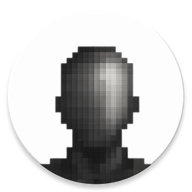
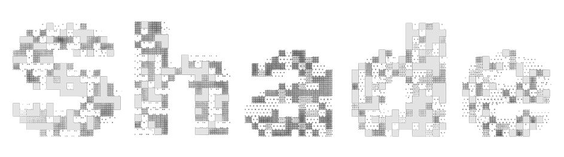

<h1 align="center">
  <a href="https://github.com/mhss1/Shade">
    
  </a>
  <br>
  
</h1>


<p align="center">
Shade is an on-device sensitive content blocker for Android. It works across any app on your phone in
real-time — no web views or wrappers required. Just native, private content filtering powered by a custom-trained on-device AI model.
</p>

<p align="center">
  <a href="https://github.com/mhss1/Shade/releases">
    
  </a>
  <a href="https://www.gnu.org/licenses/agpl-3.0">
    
  </a>
  
</p>

## Key Features

- 📱 **Works on any app** — YouTube, browsers, social media, or any other app (yes, even the
  Calculator)
- ⚡ **Optimized for performance** — Native implementation with minimal battery and memory impact
- 🔒 **Completely private** — No internet permission. All processing happens on-device. Nothing
  leaves your phone
- 🎚️ **Adjustable sensitivity** — Configure detection confidence and overlay opacity
- 🚀 **Auto-start** — Automatically activates when specific apps are opened
- 🔲 **Quick Settings tile** — Enable or disable from anywhere with a single tap
- 📖 **100% open source** — The app and AI models are free and open source under the AGPL-3.0 license

[](https://play.google.com/store/apps/details?id=com.moh.sh.app.shade)

## Under the Hood

Shade is a fully native Android application built from the ground up for speed and privacy. At its
core is a custom AI model trained specifically for this app — optimized to run smoothly on your
phone's GPU without draining your battery. Everything happens in milliseconds, right on your device.
No servers, no uploads, no waiting. Under the hood, it uses smart memory management (bitmap pooling,
caching, pre-allocated buffers) to keep things running efficiently without slowing down your phone.

## Device Compatibility

> [!NOTE]
> Shade works best on devices that support **single-app screen recording**, available on:
> - Android 14 (select Pixel devices with latest updates)
> - Android 15 and above (all devices)
>
> For older devices, Shade includes an experimental **Full Screen Mode** that uses frame similarity
> detection to reduce flicker and improve stability. However, performance and reliability may vary
> compared to single-app recording.

## License

This project is licensed under AGPL-3.0. **This includes all source code and the trained TFLite model files.**

```
Copyright (C) 2025 Mohamed Shaaban

This program is free software: you can redistribute it and/or modify
it under the terms of the GNU Affero General Public License as published by
the Free Software Foundation, either version 3 of the License, or
(at your option) any later version.

This program is distributed in the hope that it will be useful,
but WITHOUT ANY WARRANTY; without even the implied warranty of
MERCHANTABILITY or FITNESS FOR A PARTICULAR PURPOSE.  See the
GNU Affero General Public License for more details.
```

See [LICENSE](LICENSE) for the full text.
